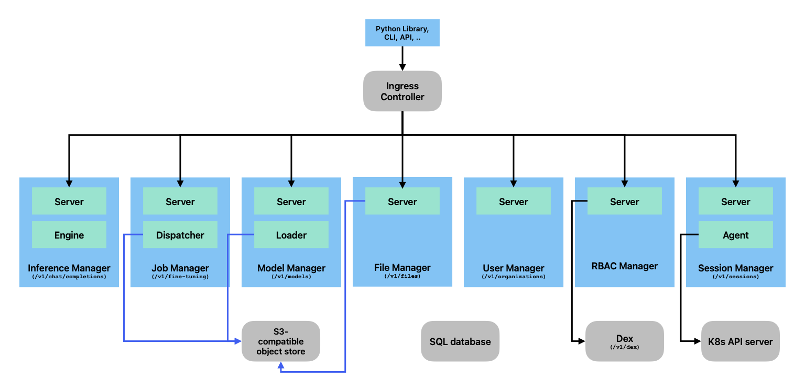

# LLM Operatror

LLM Operator builds a LLM stack that provides the *OpenAI-compatible API anywhere*, including the following functionality:

- LLM fine-tuning job management
- LLM inference (compatible with OpenAI API)
- Repository for fine-tuned models

Additionally it provides the following components as optional:
- Vector DB (e.g., https://milvus.io/)
- Object Store
- GPU Operator
- Monitoring
- MLFlow

# Use Cases

- Run LLM in an on-prem datacenter
- Run LLM at edge
- Run LLM across multiple cloud providers

# High-level Architecture

# Technical Challenges

- Be able to satisfy both the SLO of fine tuning jobs and inference on a limited number of GPUs (e.g., Run a large fine-tuning jobs at midnight when no one is using inference)
- Support heterogeneous GPUs (from A100 to B100)
- Support heterogeneous models (from small models to large models)

# An Initial Demo Scenario

1. A user uploads a dataset to File Manager.
2. The user creates a fine-tuning job in Job Manager. Job Manager generates a LoRA adapter with the uploaded dataset and stores the LoRA adapter in Model Registry.
3. Inference Manager is notified and imports a new model.
4. The user runs a chatbot using the fine-tuned model.
